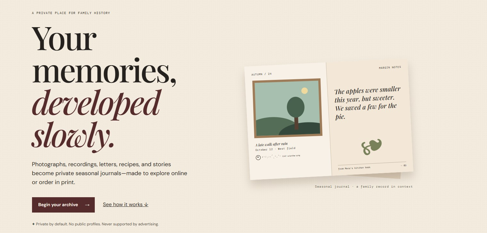
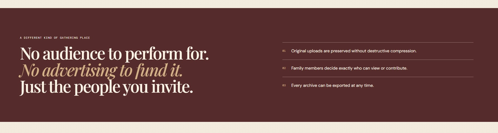

<div align="center">


# Canvas

### An AI creative studio that designs, builds, validates, and exports distinctive production websites.

Canvas turns a short business brief into a considered creative strategy and a polished responsive website. It does not simply ask a model for some HTML: it plans the direction, implements the page, tests the result, repairs production issues, and presents everything in a secure multi-device preview.

[Features](#-what-canvas-does) · [Architecture](#-how-it-works) · [Local setup](#-run-locally) · [Deploy](#-deploy-to-vercel) · [Verification](#-quality-and-verification)

</div>

---

## ✦ What Canvas does

- **Low-friction briefs** — only a brand name and business description are required.
- **Creative direction first** — audience insight, visual language, typography, color, hero concept, and conversion strategy are planned before code is written.
- **Art-directed output** — prompts actively resist repetitive card grids, fake social proof, generic SaaS copy, and other common AI-design clichés.
- **Production implementation** — every result contains portable `index.html`, `styles.css`, and `script.js` files with no build step or runtime dependency.
- **Automatic QA and repair** — generated sites are checked for semantics, SEO, accessibility basics, link integrity, enabled sections, unsafe JavaScript, and size limits.
- **Responsive preview studio** — inspect desktop, tablet, and mobile layouts in an isolated iframe.
- **Engaging generation experience** — animated, rotating progress stages explain what Canvas is working on while the model runs.
- **One-click export** — download the complete website as a ZIP or open it in a dedicated browser tab.
- **Serverless by design** — generation artifacts are returned directly to the browser; no shared output directory or persistent writable filesystem is required.

## ✺ Generated with Canvas

The example below was generated from a brief for **Afterlight Archive**, a private family-memory service. Canvas developed the editorial direction, wrote the page narrative, created the responsive visual system, and delivered the finished HTML, CSS, and JavaScript.

<p align="center">
  
</p>

<p align="center">
  
</p>

<p align="center"><sub>One brief, one cohesive art direction — from conversion-focused hero to supporting content.</sub></p>

## ◈ How it works

```text
Business brief
      │
      ▼
Creative strategy and art direction
      │
      ▼
Responsive HTML, CSS, and JavaScript
      │
      ▼
Deterministic production validation
      │
      ├── issues found ──▶ focused repair pass ──┐
      │                                          │
      └──────────────────────────────────────────┘
      │
      ▼
Sandboxed preview + quality report + ZIP export
```

The API is stateless. This prevents concurrent users from overwriting one another and makes the application compatible with Vercel's ephemeral Python functions.

## ◇ Technology

| Layer | Technology |
|---|---|
| Studio | React 19, TypeScript, Vite |
| Styling | Tailwind pipeline + custom responsive CSS |
| API | FastAPI, Pydantic |
| Generation | OpenAI Responses API + strict Structured Outputs |
| Export | JSZip |
| Preview security | Sandboxed iframe + injected Content Security Policy |
| Deployment | Vercel static frontend + Python function |

### Model routing

| Quality mode | Default model | Purpose |
|---|---|---|
| Draft | `gpt-5.6-luna` | Fast, economical exploration |
| Production | `gpt-5.6-terra` | Recommended quality/cost balance |
| Premium | `gpt-5.6` | Maximum creative and implementation quality |
| Repair | `gpt-5.6-luna` | Focused deterministic corrections |

Every model name can be overridden through environment variables. Production deployments can use snapshot IDs for reproducible behavior.

## ↳ Run locally

### Requirements

- Node.js 20.19+ or 22.12+
- Python 3.11+
- An OpenAI API key

### 1. Configure and start the API

From the repository root in PowerShell:

```powershell
Copy-Item .env.example backend/.env
# Open backend/.env and add your OPENAI_API_KEY

python -m venv .venv
.\.venv\Scripts\python.exe -m pip install -r backend\requirements.txt
.\.venv\Scripts\python.exe -m uvicorn backend.app.main:app --reload --port 8000
```

Confirm that the API is available at [http://localhost:8000/api/health](http://localhost:8000/api/health).

### 2. Configure and start the studio

Open another PowerShell terminal:

```powershell
Set-Content frontend/.env "VITE_API_BASE=http://localhost:8000"
npm --prefix frontend install
npm --prefix frontend run dev
```

Open [http://localhost:5173](http://localhost:5173). For the quickest first run, enter a brand name and a two-sentence business description, select **Draft**, and click **Design my website**.

## ⚡ Deploy to Vercel

The repository includes a root [`vercel.json`](vercel.json) with the frontend build, Python function, API rewrite, SPA fallback, duration, bundle exclusions, and security headers already configured. Both the frontend and API deploy together as one Vercel project.

1. Push the repository to GitHub.
2. Import it into Vercel, keeping the repository root as the project root.
3. Add `OPENAI_API_KEY` in **Project Settings → Environment Variables**.
4. Set `ALLOWED_ORIGINS` to the deployed origin, such as `https://canvas-example.vercel.app`.
5. Leave `VITE_API_BASE` unset so the frontend uses the same-origin `/api` route.
6. Deploy and verify `/api/health` before running a Draft generation.

> [!NOTE]
> The function is configured for a 300-second maximum duration. Your Vercel plan must support that duration. For a high-volume public product, add authentication, metering, distributed rate limiting, durable project storage, and a background job provider.

## ✓ Quality and verification

Run the complete local verification suite from the repository root:

```powershell
python -m unittest discover -s backend/tests -v
npm --prefix frontend run lint
npm --prefix frontend run build
```

Canvas rejects generated output when it finds:

- Missing or duplicate website files
- Missing semantic landmarks or multiple/missing H1 headings
- Missing page titles and descriptions
- Missing skip navigation
- Broken internal anchors or placeholder `href="#"` links
- Enabled sections absent from the page
- `eval`, `document.write`, or JavaScript network calls
- Empty or excessively large artifacts

Failed output receives one focused repair pass and must pass validation before it reaches the preview.

## 🔒 Security model

- API keys remain server-side and are never bundled into the browser application.
- Generated JavaScript runs in an iframe with `sandbox="allow-scripts"`.
- Preview documents receive a restrictive CSP that blocks network connections, forms, frames, and external scripts.
- The backend writes no generated user files to disk.
- Raw internal exceptions and filesystem paths are not returned to clients.
- Environment files, generated previews, archives, build output, and Vercel state are excluded by `.gitignore`.

## Project structure

```text
.
├── api/
│   └── index.py                 # Vercel Python entry point
├── backend/
│   ├── app/
│   │   ├── main.py              # FastAPI service
│   │   ├── models.py            # Typed briefs and responses
│   │   └── services/
│   │       └── site_generator.py
│   ├── tests/
│   └── requirements.txt
├── frontend/
│   ├── public/
│   └── src/
│       ├── App.tsx              # Creative studio
│       ├── api.ts               # API contracts and preview assembly
│       └── index.css            # Studio design system
├── .env.example
├── requirements.txt
└── vercel.json
```

## Configuration

Copy [`.env.example`](.env.example) to `backend/.env` for local development. Supported variables include:

```env
OPENAI_API_KEY=
OPENAI_DRAFT_MODEL=gpt-5.6-luna
OPENAI_PRODUCTION_MODEL=gpt-5.6-terra
OPENAI_PREMIUM_MODEL=gpt-5.6
OPENAI_REPAIR_MODEL=gpt-5.6-luna
OPENAI_MAX_OUTPUT_TOKENS=30000
ALLOWED_ORIGINS=http://localhost:5173
```

---

<div align="center">

**Canvas** — strategy, design, engineering, and QA in one focused workflow.

</div>
